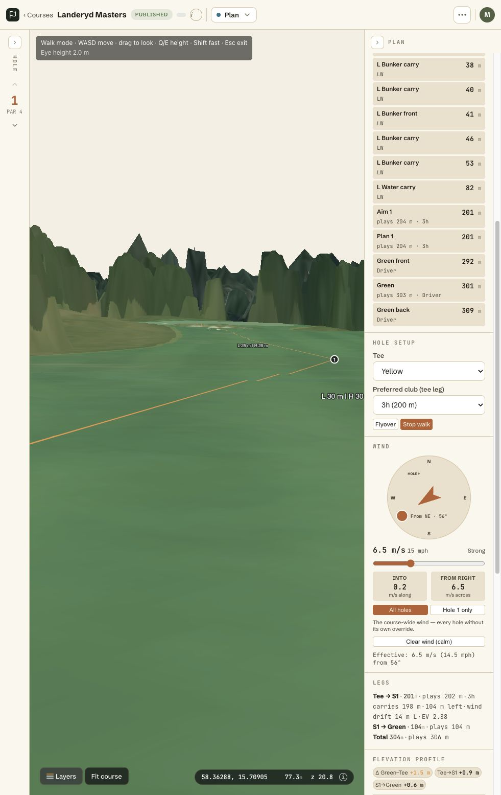
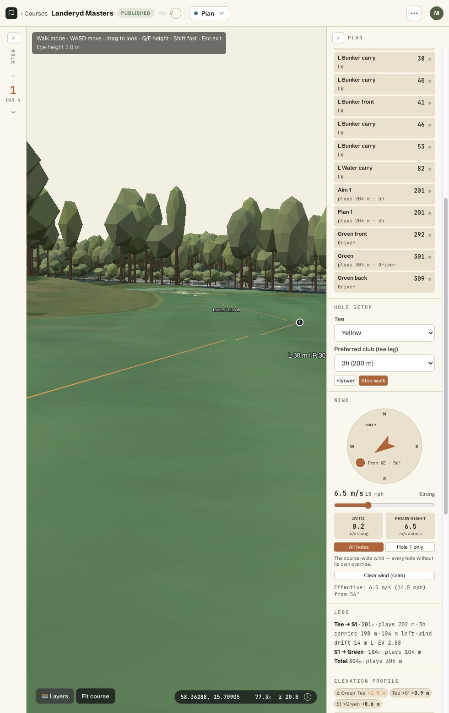

# Individual lidar trees

The pipeline generates individual crown estimates for Landeryd Masters, Landeryd Classic, and Linkan. Web walk and flyover render instanced crowns and trunks. Shared strategy and iOS clearance use crown circles with absolute ground elevations. Courses without stems retain polygon clearance.

## Generated data

| Site | Courses | Trees | JSON bytes |
| --- | --- | ---: | ---: |
| Landeryd | Masters and Classic | 44,638 | 1,586,476 |
| Linkan | Linkan | 5,886 | 208,869 |

The first extraction (37,980 and 5,346 stems) used a single 2 m / 12 m² rule. The counts above use the two-tier rule described below, which adds low crowns: Landeryd gained 6,658 stems, 2,028 of them with a top in [1, 2) m and 6,583 under 4 m; Linkan gained 540, 203 in [1, 2) m and 481 under 4 m.

Landeryd's existing Classic tile-directory symlink shares the Masters asset. Linkan stores its asset under site `208f4f4d-5242-4ef3-ac57-f3d1bc9047f1`.

Detection uses the roof-suppressed nDSM before the 7x7 canopy spread. Height-dependent local maxima seed watershed segmentation. Cells join the candidate mask from 1 m in components of at least 4 m²; a crown with its top at or above 3 m needs 12 m² of support. Radius follows segmented area, capped at 35% of height (with a 1.5 m floor on the cap) and 10 m. Coordinates estimate crown tops; trunk positions and species have no field verification.

The 1 m floor and 4 m² support were set from an isolated bush on Landeryd Masters hole 5, 215 m from the yellow tee and 5 m right of the tee-green line: 7 m² of nDSM at or above 0.5 m, top 1.96 m, mean 1.55 m. The earlier 2 m rule missed it; the asset now holds it as a 1.9 m stem with a 1.5 m radius. Of 1,867 Landeryd components with a top in [1, 2) m, eight random orthophoto checks showed six with vegetation (bushes, young plantation, understory) and two with objects (silage bales, a residential yard).

Initial extraction took 55.9 seconds for Landeryd and 17.6 seconds for Linkan. Reprocessing saved rasters with the final support threshold took 3.8 and 0.4 seconds.

The versioned JSON schema contains EPSG:3006 x/y, height, crown radius, and RH2000 ground elevation. The manifest declares `assets["tree-stems"]`. The server resolves course and site IDs at `/tiles/<id>/tree-stems.json`. Publish bundles carry the asset; iOS downloads and validates it for offline clearance.

## Hole 1 walk comparison

Both screenshots use the same fairway position on Landeryd Masters hole 1 with a 2 m eye height. The baseline shows the retained surface DSM fallback. The second shows individual trees on the ground DEM. Terrain switching preserves the physical camera position.

| Surface DSM baseline | Individual trees |
| --- | --- |
|  |  |

## Orthophoto validation

The holdout window covers EPSG:3006 bounds `541550,6469000,541850,6469300`, a 300 m square east of the clubhouse. It contains 385 detections. A fixed random seed, `20260906`, selected 50 detections after tuning the support threshold in a separate clubhouse window.

The assistant visually inspected the numbered 24 m orthophoto crops. A match required the detection center to coincide with one distinguishable crown. That review confirmed 33 of 50 detections, or 66%. The other 17 remain ambiguous because of shadows, overlapping branches, or offsets. None of the 50 is clearly on a roof. This is a visual confirmation fraction, with no surveyed trunk positions or recall measurement.

Ambiguous sample numbers are 14, 16, 17, 21, 22, 24, 31, 34, 35, 36, 38, 39, 42, 43, 45, 46, and 49. An initial, less strict crown-presence review confirmed 40. The saved sample records both assessments.

- [300 m holdout overlay](landeryd-holdout-300m-stems.png)
- [Samples 1 through 25](landeryd-holdout-samples-1.jpg)
- [Samples 26 through 50](landeryd-holdout-samples-2.jpg)
- [Sample coordinates and assessments](holdout-samples.json)
- [Separate clubhouse overlay](landeryd-clubhouse-300m-stems.png)

The 12 m² support threshold reduced detections in the clubhouse tuning window from 119 to 50. Some roof-adjacent detections remain. Dense crowns can merge, and branches or understory can produce extra maxima. Clearance uses the full height across each crown circle, overestimating the modeled crown edge. Missing crowns and detection errors can still understate obstacles.

## Rendering performance

The renderer uses instanced draw calls (at most sixteen), a 1.2 km distance limit, and per-tree frustum tests. It uploads transforms and colors only for visible instances. Stems under 4 m draw as shrubs from one instanced mesh: a flattened crown on the ground with no trunk, in a darker green. The measurements below predate the shrub mesh.

| Measurement | Loaded trees | Visible at capture | Median frame | P95 frame | Median fps |
| --- | ---: | ---: | ---: | ---: | ---: |
| Apple M5 Pro, Landeryd walk including terrain changes | 37,980 | 857 | 16.7 ms | 44.8 ms | 59.9 |
| Apple M5 Pro, warm Landeryd flyover | 37,980 | 622 | 16.7 ms | 18.2 ms | 59.9 |
| SwiftShader, synthetic E2E walk | 40,000 | 4,711 | 819.2 ms | 979.4 ms | 1.2 |

Native measurements use rolling windows of 120 moving render intervals in the in-app browser. Visible counts vary during each window. They support approximately 60 fps median for these views, not sustained 60 fps for every view or GPU. The software-GPU test passed checks for instance counts, culling, layer switches, and camera restoration. It does not meet the performance target.

Saved measurements are [native walk](native-walk-performance.json), [native flyover](native-flyover-performance.json), and [software GPU](software-gpu-performance.json).

## Reproduction

Run `trees-stems` using local COPC inputs and a session scratch directory, as documented in [the pipeline README](../../../pipeline/README.md). Then refresh the installed manifest metadata that the apps read:

```sh
cd server
bun scripts/register-tile-manifest.ts <course-or-site-id> --db ../data/app.sqlite --data-dir ../data
```

Refresh both Landeryd course registrations when using their existing separate site IDs. Refresh Linkan through its course or site ID. Reload the web course or refresh the iOS bundle to discover the new asset.

The server validates asset schema and count before registration. Missing assets retain polygon fallback. A valid empty asset represents a course with no detected crowns. Missing origin elevation produces unknown clearance until elevation becomes available.

## Automated verification

E2E specifications 25 through 30 run against isolated seeded data.

| Suite | Result |
| --- | --- |
| Pipeline pytest | 279 passed |
| Shared bun test | 400 passed |
| Web bun test | 1,195 passed |
| Server bun test | 568 passed |
| iOS xcodebuild test | 1,382 tests, 2 skipped, 0 failures |
| E2E 25 through 30, normal order | 11 passed |
| E2E 25 through 30, reversed order | 11 passed |

Server and client typechecks passed. The iOS test destination was iPhone 17 Pro; the built app was installed and launched there. The optional web test-fixture typecheck still reports 15 existing fixture typing errors.

Original orthophotos and existing ortho/terrain tiles were unchanged.
